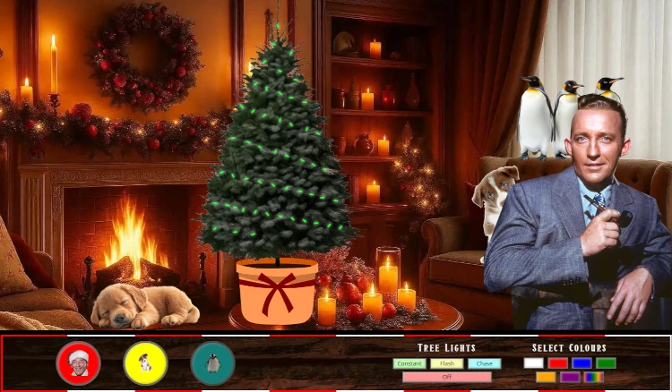

# Bing Crosby Eat Your Heart Out

This project is a dynamic sensory experience, a feast for the eyes and ears, with an arborial festive theme. The finished article is, in effect, a fully responsive, fully interactive Advanced Christmas Simulator.

## UX - Strategy

### Project goal

The main requirement is a simple project that needs to be delivered in an extremely short timescale by two relatively inexperienced developers, to a reasonably high standard. The user stories below represent on one hand the dev requirements, and on the other hand the very minimum a user might expect in order to have a passably diverting experience.

### Site Developer - user stories

As developers we have limited time due to work committments and a much reduced team from what one would normally expect from a hackathon.  This shapes our requirements, as does the stated Hackathon theme.

 - Simplicity: the site cannot be complex, have too many pages or too many moving parts.  It must also be front end only.
 - Interactivity:  There has to be some form of user interaction to drive engagement
 - Christmas: It must be about christmas
 - Collaborative:  The production process must be structured so that there is a clear division of tasks, a clear order to how the tasks will be completed, and well organised collaborative process, to take account of our inexperience in these environments.

 ### Site Use - user stories.

 Really this is about what will make a good website:

 - Slick UI:  The user wants everyone on the page to be easily (if not immediately) discoverable
 - Interactive Fun:  The user would love it if there were some things for them to press that affect the page, ideally in a diverting enough way to fill half an hour of their lunch break
 - Novelty:  The user would prefer it if the concept was not something that's been done a lot of times before.
 - On topic: Since the entire user-base is likely to consist exclusively of hackathon judges (with the possible exception of my girlfriend) , the site needs to meet all of the Hackathon requirements.

 ## UX- Everything Else

 ### Technology

  - As a front end project the tech will consist of the languages the devs have in common - vanilla HTML, CSS and Javascript with the possible addition of Bootstrap.
  - For the sake of simplicity and because of the timescales involved as well as the brief, this will be a single page application.

### Core Elements

 - As a result of a brief and lively internal discussion we have decided on two core elements - a background image of a chritsmas tree and foreground section which include christmas lights which can be adjusted into various configurations through a simple UI.  
 - Additional elements of the page will be entirely time dependent.

### Optional Features

 - additional background / foreground objects one might expect to find in a christmassy location.
 - Additional themes (ie background/foreground images and color palate changes)

### Skeleton and Design

Since it's a single page application with a clear strucutre and one day to produce it we proceeded straight to the build. It consists of a background image with a tree in the foreground and a control panel at the bottom.  The lights were positioned absolutely within the tree's element to avoid scaling issues. Other Christmassy Easter Eggs were included later on.

## Deployment

The website has been deployed on github pages [HERE](https://rowlandcoping.github.io/CI-Hackathon-Christmas-13/)

## Technologies Used

HTML: Layout.\
CSS: effects and positioning, mainly using flexbox.\
Javascript: Light and pop-up element controls.\
GIT and Github: Version control.\
GIMP: Image Handling.\
Inkscape, Bing Image Creator: Image Creation.\
squoosh.app: Image compression and conversion.

All images are either created by the authors or licensed for non-commercial use.
The music file is publicly and freely available via the best thing on the internet (ie the internet archive).

## Contributors

Attila Biacsi:  Original Concept, lead JavaScript developer.\
John Hall: Site design and layout, image work.

